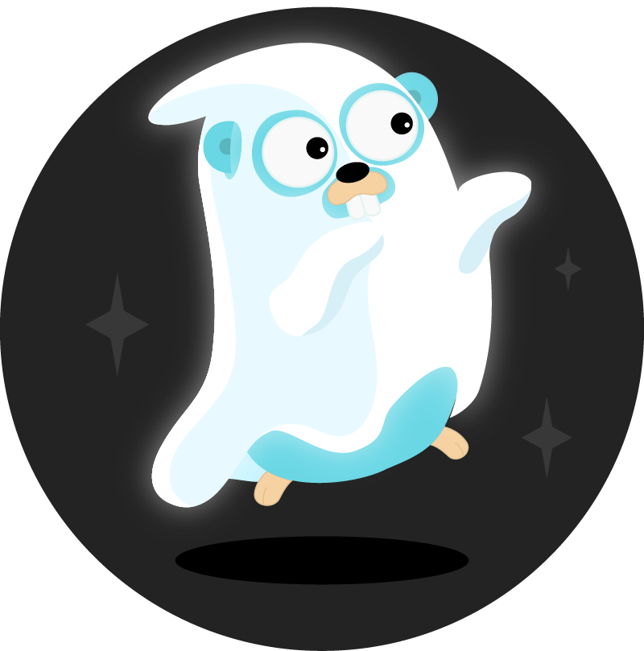

# eyeson Ghost - Go Host Streaming Client

A [pion](https://github.com/pion/webrtc) based eyeson client written in Go.
Build cross-plattform video applications that connect to any eyeson video
conference.



Create a [community eyeson API key](https://developers.eyeson.team) to get started,
visit the [documentation](https://eyeson-team.github.io/api/) or [eyeson-go
package](https://pkg.go.dev/github.com/eyeson-team/eyeson-go)

## Usage

Visit [examples](examples/) to find ready-to-use cli apps for streaming with
RTMP or local video files.

Please note that you're required to keep the meeting busy as if no participants
are connected it will shutdown after a short period of time. A common way to do
so is to join with a participant using the web interface and mute your audio
and video.

## Development

```sh
$ make test # run the testsuite
```
